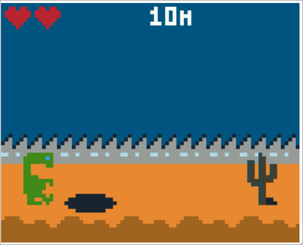

# E.T Runner

IPI CDEV 2023-2024 - A.Kita & JC.Kleinbourg

## À propos

Jeu E.T Runner réalisé en C pour la machine de Retro gaming Gamebuino.

> Important :
Le jeu est prévu pour fonctionner sur cet émulateur : http://games.aoneill.com/meta-emulator/

Afin de pouvoir coder en collaboration, nous avons scindé le code en plusieurs fichiers, rassemblées en include depuis `Runner-Buino.ino`.

Le jeu est un runner inspiré de Dino-Run reprenant le sprite de E.T en référence au jeu Atari 2600.

## Contrôles

Le but du jeu est de marquer le plus haut score en évitant les obstacles.

- A, B : Lancer le jeu
- A, B, haut : Sauter
- bas : Redescendre rapidement (à intervale)

## Conclusion

L'exercice nous a beaucoup plu, coder en collaboration a été une expérience enrichissante, même si 24h était très court et frustrant 🤯. Nous aurions pu mieux faire, comme peaufiner le gameplay et rajouter du son, mais nous sommes très satisfaits pour une première !

